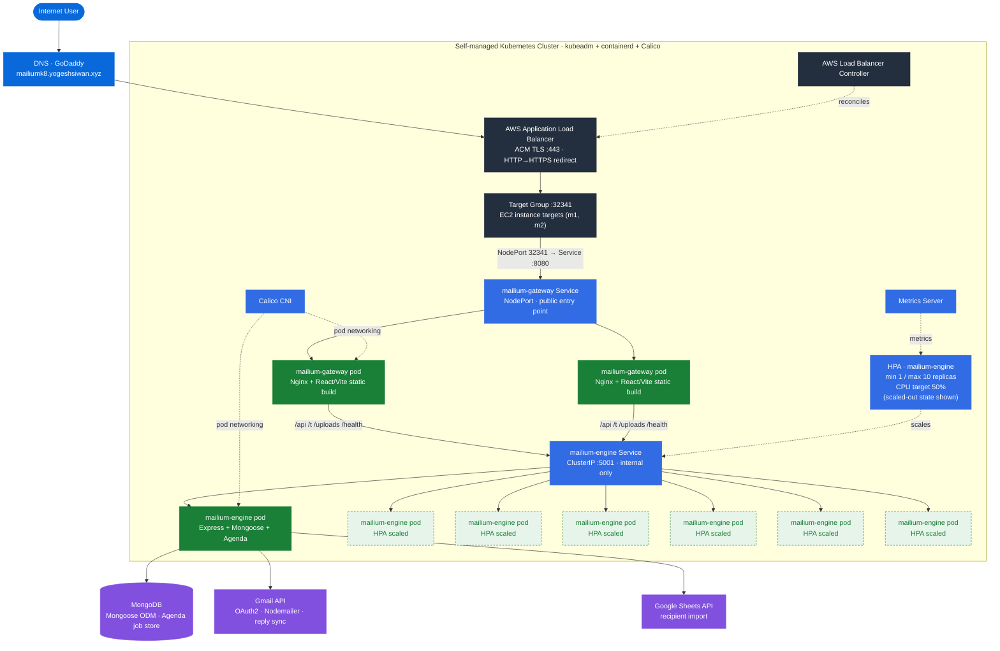

<div align="center">

# Mailium

**Self-hosted email campaign management with a full-stack application and a self-managed Kubernetes deployment.**

[](https://kubernetes.io/)
[](https://aws.amazon.com/)
[](https://www.docker.com/)
[](https://nodejs.org/)
[](https://react.dev/)

[**Live application**](https://mailiumk8.yogeshsiwan.xyz) · [**Architecture**](docs/architecture.md) · [**Kubernetes**](docs/kubernetes.md) · [**AWS**](docs/aws.md) · [**Autoscaling**](docs/autoscaling.md) · [**Troubleshooting**](docs/troubleshooting.md)

</div>

---

## Overview

Mailium is a self-hosted email campaign management application modeled after Mailmeteor. It provides a workflow for creating campaigns, importing and filtering recipients, composing rich-text messages, using templates, attaching files, scheduling sends, and managing follow-ups through Gmail integrations.

The project also serves as a practical platform-engineering exercise: an application originally deployed with rootless Docker Compose was reproduced on a **self-managed Kubernetes cluster bootstrapped with kubeadm**, then exposed through an AWS Application Load Balancer with ACM TLS and configured with CPU-based Horizontal Pod Autoscaling.

> **Project scope:** the Kubernetes environment is a portfolio/learning deployment. It demonstrates the implemented architecture and operational work without claiming production-grade high availability or security hardening that has not been implemented.

## Architecture

The public entry point is the router layer. The backend remains an internal `ClusterIP` service, so application traffic is not sent directly to the API from the internet.



### Request path

```text
Client
  │
  ├── HTTP :80 ──► ALB ──► 301 HTTPS redirect
  │
  └── HTTPS :443 ─► ALB ─► ACM TLS termination
                         │
                         ▼
                    NodePort :32341
                         │
                         ▼
                  cache-router :8080
                         │
              ┌──────────┴──────────┐
              │                     │
         React frontend      /api /t /uploads /health
                                    │
                                    ▼
                         cache-runtime :5001
                                    │
                         ┌──────────┴──────────┐
                         ▼                     ▼
                     MongoDB              Google APIs
```

## What the project demonstrates

| Area | Implementation |
|---|---|
| Application | React/Vite frontend + Node.js/Express backend |
| Containers | Docker + rootless Docker Compose baseline |
| Cluster bootstrap | Kubernetes `kubeadm` |
| Runtime | `containerd` |
| Pod networking | Calico CNI |
| Public ingress | AWS Load Balancer Controller + ALB |
| TLS | AWS Certificate Manager |
| Internal routing | Kubernetes `ClusterIP` + router reverse proxy |
| Metrics | Metrics Server |
| Autoscaling | `autoscaling/v2` HPA, CPU target 50%, 1–10 replicas |
| Cloud platform | AWS EC2, VPC networking, security groups |

## Application capabilities

- Campaign creation and editing
- Recipient selection and CSV-style recipient import
- Recipient exclusions and filtering workflows
- Rich-text email composition
- Reusable campaign templates
- Attachments and test emails
- Scheduled campaigns and autopilot-style settings
- Follow-up sequences and same-thread replies
- Gmail OAuth integration and email sending
- Campaign detail and analytics/reporting surfaces

## Deployment evolution

Mailium has two deployment stories in this repository:

```text
Rootless Docker Compose
        │
        │  application baseline
        ▼
┌───────────────────────┐
│ cache-runtime         │  Express + Agenda
│ cache-router          │  Nginx + React
└───────────────────────┘
        │
        │ migration / reproduction
        ▼
Self-managed Kubernetes
        │
        ├── kubeadm
        ├── containerd
        ├── Calico
        ├── Metrics Server
        ├── HPA
        └── AWS ALB + ACM
```

The Docker Compose deployment remains the long-running application baseline. The Kubernetes environment captures the orchestration and cloud-integration work separately.

## Repository structure

```text
mailium/
├── client/                 # React/Vite frontend
├── server/                 # Node.js/Express backend
├── docs/                   # Architecture and infrastructure documentation
├── k8s/                    # Kubernetes manifests and deployment configuration
├── docker-compose.yml      # Rootless Docker Compose baseline
├── .env.example            # Configuration template
└── README.md
```

## Local development

### Prerequisites

- Node.js 20+
- MongoDB
- Google OAuth credentials for the integrations you want to use

### Backend

```bash
cd server
npm install
```

Create `server/.env` from the required environment variables and start the development server:

```bash
npm run dev
```

The backend listens on port `5001` in the containerized deployment; local development configuration may differ according to the environment file.

### Frontend

```bash
cd client
npm install
npm run dev
```

Vite normally serves the development frontend on port `5173`.

## Kubernetes documentation

The Kubernetes work is documented separately so each layer can be understood without turning the README into an installation manual.

- **[Architecture](docs/architecture.md)** — application boundaries, request flow, and deployment model
- **[Kubernetes](docs/kubernetes.md)** — kubeadm, containerd, Calico, workloads, Services, probes, and cluster layout
- **[AWS](docs/aws.md)** — EC2, networking, Load Balancer Controller, ALB, ACM, and security groups
- **[Autoscaling](docs/autoscaling.md)** — Metrics Server, HPA configuration, load testing, and verified scale-out/scale-in
- **[Troubleshooting](docs/troubleshooting.md)** — real infrastructure failures and the fixes used during the build

## Evidence and screenshots

Operational screenshots will be added under `screenshots/` as the cluster is documented. Planned evidence includes:

- Kubernetes nodes and workloads
- ALB listeners and target health
- ACM certificate status
- HPA scale-out and scale-in
- Metrics Server output
- Public HTTPS application access

## Security notes

- Never commit real credentials or production `.env` files.
- Use `.env.example` as the configuration template.
- The current Kubernetes node security-group configuration was intentionally permissive during the learning phase and should be hardened before treating the cluster as a production deployment.
- IAM for the AWS Load Balancer Controller currently relies on the EC2 node instance role; workload identity such as IRSA/Pod Identity is a future hardening improvement.

## Status

The Kubernetes deployment is an actively documented infrastructure experiment. AWS resources may be temporary, but the repository is intended to preserve the architecture, manifests, evidence, and lessons learned after the cluster is decommissioned.

---

<div align="center">

**Mailium** · Application engineering + Kubernetes + AWS infrastructure

</div>