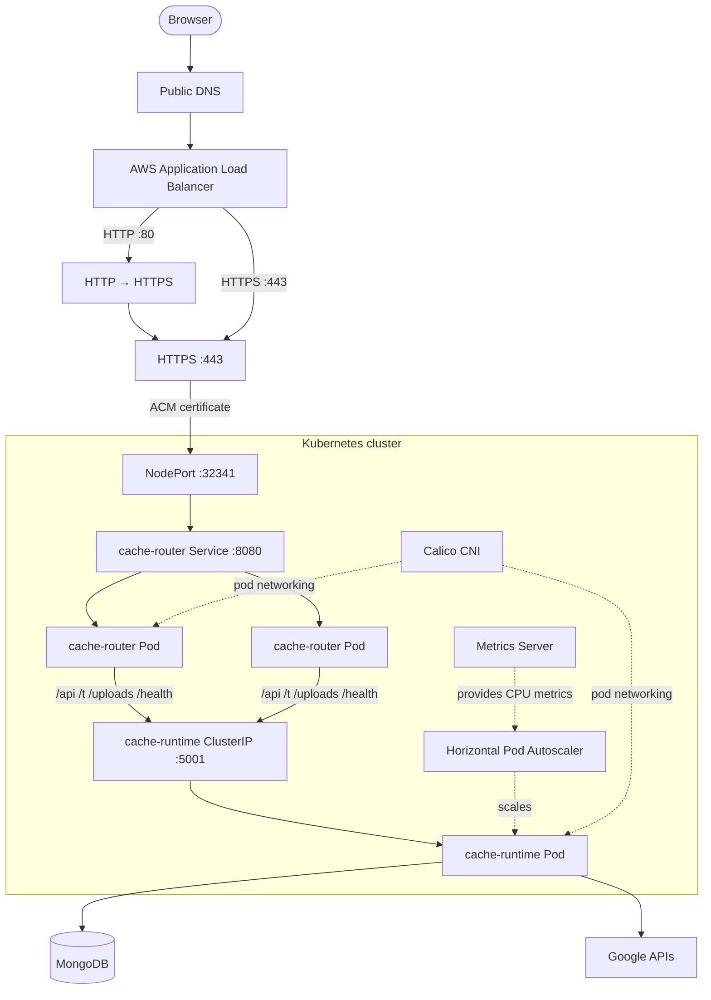
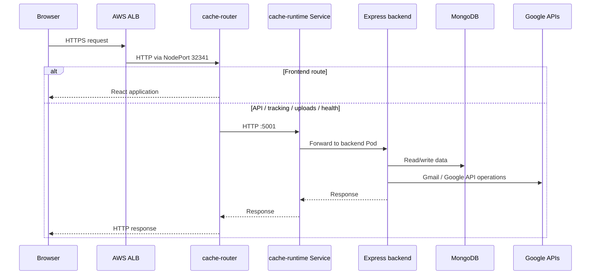
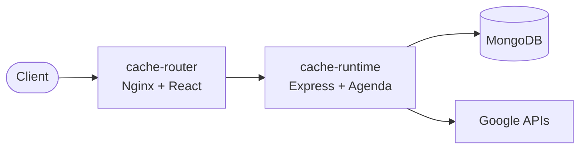

# Architecture

Mailium is a full-stack email campaign application that evolved from a rootless Docker Compose deployment into a self-managed Kubernetes deployment on AWS EC2.

The important architectural boundary is the router: **public traffic terminates at the AWS Application Load Balancer and is forwarded to `cache-router`; the Express backend remains an internal Kubernetes Service.**

## High-level architecture



## Request routing

The request path is deliberately split into public and internal layers:

1. DNS resolves the public hostname to the AWS ALB.
2. Port 80 redirects to HTTPS.
3. The ALB terminates TLS using an ACM-issued certificate.
4. The ALB forwards traffic to NodePort `32341` on the Kubernetes nodes.
5. The `cache-router` Service receives the traffic on port `8080`.
6. Nginx serves the React frontend for `/`.
7. Nginx proxies backend paths to the internal `cache-runtime` Service on port `5001`.
8. The Express backend communicates with MongoDB and Google APIs.



## Application boundary

### `cache-router`

The router container is the public application edge. It serves the built React application and reverse-proxies backend paths.

| Path | Destination |
|---|---|
| `/` | React frontend |
| `/api/` | `cache-runtime:5001` |
| `/t/` | `cache-runtime:5001` |
| `/uploads/` | `cache-runtime:5001` |
| `/health` | `cache-runtime:5001` |

### `cache-runtime`

The runtime container runs the Node.js/Express backend and background-job processing. In Kubernetes it is exposed through a `ClusterIP` Service rather than directly through the ALB.

The backend uses MongoDB-backed application data and Google APIs for Gmail-related functionality.

## Docker Compose baseline

The original deployment uses two application services:



The Compose file builds `server/` for `cache-runtime` and `client/` for `cache-router`. The runtime exposes port `5001` internally, while the router publishes its port through the configured router port.

## Kubernetes evolution

The Kubernetes deployment keeps the same application boundary while moving infrastructure responsibilities into Kubernetes and AWS:

```text
Docker Compose
   │
   ├── cache-runtime
   └── cache-router
          │
          ▼
Self-managed Kubernetes
   │
   ├── kubeadm cluster bootstrap
   ├── containerd runtime
   ├── Calico pod networking
   ├── Kubernetes Services
   ├── Metrics Server + HPA
   └── AWS ALB + ACM through AWS Load Balancer Controller
```

## Design decisions

### Keep the backend internal

The backend is a `ClusterIP` Service. This gives the public edge a single responsibility and avoids exposing the Express port directly to the internet.

### Use the ALB as the cloud ingress layer

The AWS Load Balancer Controller reconciles Kubernetes ingress configuration into AWS load-balancing resources. The ALB performs TLS termination and forwards application traffic to the Kubernetes NodePort.

### Scale the backend, not the router

The current HPA targets `cache-runtime`. This matches the resource-intensive application tier while keeping the frontend/router layer simple.

### Keep the deployment reproducible

The cluster itself may be temporary, but the Kubernetes configuration and documentation are being preserved in Git so the infrastructure work remains reviewable after the AWS environment is removed.
