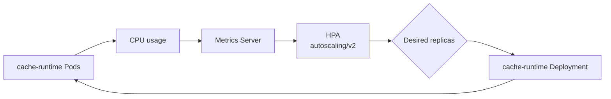

# Autoscaling

Mailium's backend is configured with a Kubernetes Horizontal Pod Autoscaler (HPA) driven by CPU utilization.

The autoscaling path is:



## Configuration

The current HPA configuration is:

| Setting | Value |
|---|---:|
| API | `autoscaling/v2` |
| Minimum replicas | `1` |
| Maximum replicas | `10` |
| CPU target | `50%` |
| Metrics source | Metrics Server |
| Target | `cache-runtime` Deployment |

The backend Deployment defines CPU requests and limits, which gives the HPA a resource baseline from which CPU utilization can be evaluated.

## Why resource requests matter

CPU-based HPA utilization is evaluated relative to the CPU request. Without a meaningful request, a utilization percentage does not provide the intended scaling signal.

The current backend resources are:

```yaml
resources:
  requests:
    cpu: 100m
    memory: 256Mi
  limits:
    cpu: 500m
    memory: 512Mi
```

## Metrics pipeline

The flow from workload to scaling decision is:

```text
cache-runtime Pod
      │
      │ CPU / memory metrics
      ▼
Metrics Server
      │
      ▼
Kubernetes metrics API
      │
      ▼
Horizontal Pod Autoscaler
      │
      ▼
Deployment replica count
```

Verification commands:

```bash
kubectl top pods -n mailium
kubectl get hpa -n mailium
kubectl describe hpa -n mailium cache-runtime
```

A healthy HPA should report that it can scale, that its target metric is available, and that it is not being limited by its configured maximum.

## Verification performed

The HPA was tested against the live cluster rather than being documented only from YAML.

The observed behavior was:

1. Baseline backend replica count was `1`.
2. CPU load was generated against the backend workload.
3. Metrics Server reported increased CPU usage.
4. HPA detected utilization above the configured target.
5. The backend Deployment scaled out.
6. After the load stopped and utilization dropped, the HPA scaled the Deployment back down.

Both scale-out and scale-in were verified successfully.

## Useful commands

Watch the HPA:

```bash
kubectl get hpa -n mailium -w
```

Watch backend Pods:

```bash
kubectl get pods -n mailium -l app=cache-runtime -w
```

Watch resource usage:

```bash
kubectl top pods -n mailium
```

Inspect HPA decisions and events:

```bash
kubectl describe hpa -n mailium cache-runtime
```

## What the HPA does not solve

HPA only changes the number of backend Pods. It does not automatically solve:

- database capacity;
- external Gmail API rate limits;
- node capacity;
- pod placement constraints;
- application-level bottlenecks;
- persistent storage scaling.

The current cluster therefore demonstrates horizontal application scaling, not end-to-end elastic infrastructure.

## Future improvements

Potential next steps include:

- add explicit workload distribution rules for the router;
- evaluate memory/custom metrics where useful;
- add a node autoscaling strategy if the platform were moved to a longer-lived environment;
- establish application-level load tests and repeatable benchmark thresholds;
- capture screenshots of HPA scale-out and scale-in for the repository evidence section.
