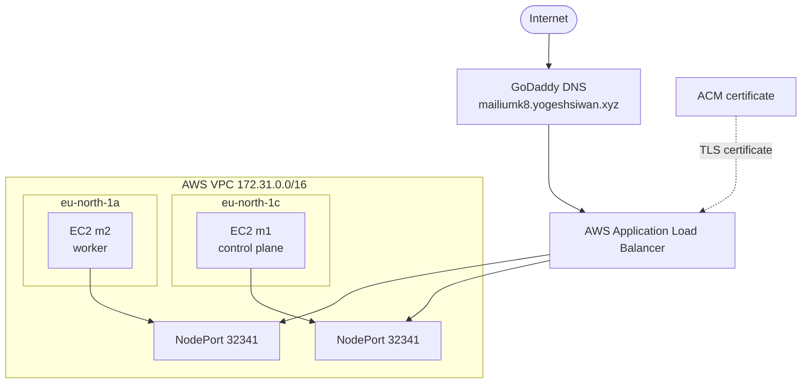

# AWS Infrastructure

Mailium's Kubernetes environment runs on AWS EC2 in `eu-north-1` and uses the AWS Load Balancer Controller to integrate Kubernetes ingress with an internet-facing Application Load Balancer.

## AWS architecture



## Public hostname

The current public hostname is:

```text
https://mailiumk8.yogeshsiwan.xyz
```

GoDaddy provides the DNS record. The hostname resolves to the AWS ALB DNS name rather than directly to an EC2 public IP.

## Application Load Balancer

The ALB is provisioned by the AWS Load Balancer Controller from the Kubernetes Ingress configuration.

Current listener behavior:

```text
HTTP :80
   │
   └── 301 redirect ──► HTTPS :443
                              │
                              ▼
                       ACM TLS termination
                              │
                              ▼
                       NodePort :32341
```

The HTTPS listener uses the ACM-issued certificate for `mailiumk8.yogeshsiwan.xyz`.

The ALB uses instance targets, so traffic is forwarded to the Kubernetes NodePort on the EC2 nodes.

## ACM certificate

The certificate is DNS-validated and currently issued for:

```text
mailiumk8.yogeshsiwan.xyz
```

The certificate does **not** currently cover `mailium.yogeshsiwan.xyz`. A separate certificate or a SAN/wildcard design would be required for that hostname.

## AWS Load Balancer Controller

The AWS Load Balancer Controller is the Kubernetes integration point for the ALB.

Conceptually:

```text
Kubernetes Ingress
       │
       ▼
AWS Load Balancer Controller
       │
       ├── creates / updates ALB
       ├── configures listeners
       ├── configures target groups
       └── reconciles AWS state
```

The controller does not handle every application request itself. Once reconciled, the AWS ALB performs the actual request forwarding.

## Target group

The current target group uses:

- target type: `instance`
- backend port: NodePort `32341`
- health check path: `/`
- protocol: HTTP

The public HTTPS connection therefore has two distinct transport layers:

```text
Client ──HTTPS──► ALB ──HTTP──► EC2 NodePort ──► Kubernetes Service ──► Pod
             TLS terminates here
```

## Security groups

The learning cluster currently uses:

- a shared node security group for the Kubernetes EC2 instances;
- an ALB/backend security-group path allowing the ALB to reach NodePort `32341`;
- broader node ingress rules than would be appropriate for a production deployment.

The intended hardened model is:

```text
Internet
   │
   ▼
ALB security group
   │  HTTPS :443
   ▼
Node security group
   │  NodePort :32341 only from ALB SG
   ▼
Kubernetes Service
```

SSH and Kubernetes API access should also be restricted to known administrative sources rather than broad internet ranges.

## IAM integration

The current AWS Load Balancer Controller setup uses the EC2 node instance role. This is functional for the learning cluster, but it means the nodes provide the AWS permissions used by the controller.

A production-oriented design would move those permissions to workload identity, such as IAM Roles for Service Accounts (IRSA) or EKS Pod Identity where applicable.

## Troubleshooting history

Several AWS/Kubernetes integration issues were encountered during the build:

1. The second EC2 node initially did not have the expected IAM instance profile.
2. The shared node security group was missing the Kubernetes cluster tag required by the controller workflow.
3. Provider IDs were not initially present in the expected AWS form, so kubelet/node metadata had to be corrected.
4. ALB target health had to be validated separately from Kubernetes Pod readiness.

These incidents are documented in more detail in [`troubleshooting.md`](troubleshooting.md).

## Cost and lifecycle

The Kubernetes environment is temporary and tied to available AWS resources/credits. The repository therefore preserves the infrastructure design, manifests, commands, and evidence so the work remains reproducible as a portfolio artifact even after the EC2 cluster is decommissioned.
