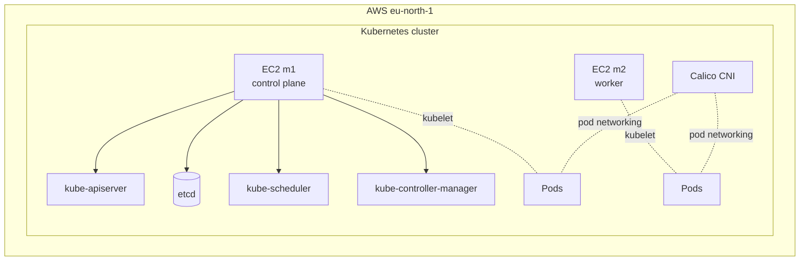

# Kubernetes Deployment

This document records the Kubernetes layer used to run Mailium on AWS EC2.

The cluster was bootstrapped manually with `kubeadm` rather than using a managed Kubernetes control plane. The goal was to understand the cluster lifecycle, networking, scheduling, service discovery, ingress, metrics, and autoscaling layers directly.

## Cluster layout



## Core versions used

| Component | Version / configuration |
|---|---|
| Kubernetes | kubeadm-managed cluster, v1.36.x |
| Container runtime | containerd 2.2.2 |
| CNI | Calico OSS 3.32.1 |
| Metrics | Metrics Server v0.9.0 |
| AWS ingress | AWS Load Balancer Controller v3.5.0 |
| Region | AWS `eu-north-1` |
| Pod CIDR | `192.168.0.0/16` |
| Service exposure | ClusterIP + NodePort + ALB |

## Bootstrap model

The cluster follows the standard kubeadm workflow:

```text
EC2 instances
    │
    ├── containerd
    ├── kubelet
    └── kubeadm
          │
          ▼
    control-plane initialization
          │
          ▼
    worker node join
          │
          ▼
    Calico installation
          │
          ▼
    application workloads
```

The important learning point is that kubeadm bootstraps Kubernetes components; it does not provide the cloud networking, load balancer, or application deployment by itself. Those layers were configured separately.

## Container runtime

Both nodes use containerd with the Kubernetes runtime integration. The runtime uses the systemd cgroup driver.

This gives Kubernetes a CRI-compatible runtime without requiring Docker Engine on the nodes.

## Calico networking

Calico provides pod networking across the cluster.

The configured pod CIDR is `192.168.0.0/16`, while the AWS VPC uses the `172.31.0.0/16` address space. The ranges do not overlap.

The current Calico configuration uses VXLAN with CrossSubnet behavior and maintains the Calico node networking/control-plane components required by the cluster.

```text
AWS VPC:       172.31.0.0/16
                    │
              EC2 node network
                    │
          ┌─────────┴─────────┐
          ▼                   ▼
  Pod CIDR m1           Pod CIDR m2
 192.168.0.0/24        192.168.1.0/24
          │                   │
          └────── Calico ─────┘
```

## Application workloads

### `cache-router`

- replicas: 2
- image: `ghcr.io/yogesiwan/mailium-frontend:latest`
- container port: `8080`
- Service type: `NodePort`
- NodePort: `32341`
- CPU request/limit: `100m` / `200m`
- memory request/limit: `64Mi` / `128Mi`
- image pull secret: `ghcr-secret`

The intended topology is one router replica per node. The current cluster snapshot has both Ready replicas on m1, so topology spreading/anti-affinity is a known improvement rather than an implemented guarantee.

### `cache-runtime`

- replicas: 1 at baseline
- image: `ghcr.io/yogesiwan/mailium-backend:1.0.0`
- container port: `5001`
- Service type: `ClusterIP`
- CPU request/limit: `100m` / `500m`
- memory request/limit: `256Mi` / `512Mi`
- startup probe: `/health`
- readiness probe: `/ready`
- liveness probe: `/live`
- configuration source: Kubernetes Secret `mailium-backend-env`

The runtime is the HPA target and can scale horizontally when CPU utilization crosses the configured threshold.

## Service discovery

The router reaches the backend through the Kubernetes Service name:

```text
cache-router Pod
      │
      │ HTTP :5001
      ▼
cache-runtime Service
      │
      ▼
cache-runtime Pod(s)
```

The Service abstracts the backend Pod IP. This means the router does not need to know which backend Pod is currently running.

## Health probes

The backend uses three different probe roles:

| Probe | Endpoint | Purpose |
|---|---|---|
| Startup | `/health` | Allow the application time to start before normal health evaluation |
| Readiness | `/ready` | Decide whether the Pod should receive Service traffic |
| Liveness | `/live` | Detect an unhealthy running process |

This separation is important because an application can be alive while still not being ready to receive traffic.

## Metrics Server

Metrics Server provides resource metrics consumed by the HPA.

Typical verification:

```bash
kubectl top nodes
kubectl top pods -A
```

If `kubectl top` returns current CPU and memory values, the metrics pipeline is available for HPA decisions.

## AWS Load Balancer Controller

The controller runs in `kube-system` and watches Kubernetes resources such as Ingress objects. It reconciles those resources with AWS load-balancing infrastructure.

The current controller deployment runs two replicas for the controller itself. The AWS ALB is still the component that performs runtime request distribution; the controller is the Kubernetes-to-AWS reconciliation layer.

## Useful inspection commands

```bash
kubectl get nodes -o wide
kubectl get pods -A -o wide
kubectl get svc -A
kubectl get ingress -A
kubectl describe ingress -n mailium cache-router-ingress
kubectl top nodes
kubectl top pods -A
```

For workload debugging:

```bash
kubectl get pods -n mailium
kubectl describe pod -n mailium <pod-name>
kubectl logs -n mailium <pod-name>
kubectl get events -n mailium --sort-by=.lastTimestamp
```

## Known limitations

The current cluster is a learning/portfolio environment rather than a production-ready platform. Known gaps include:

- router replicas are not guaranteed to be distributed across nodes;
- node security groups are broader than a production deployment should require;
- AWS Load Balancer Controller currently uses the EC2 node instance role rather than workload identity;
- the control plane is not highly available;
- the worker node has significantly less memory than the control-plane node and needs monitoring under load.

These limitations are documented intentionally rather than hidden behind generic claims of production readiness.
